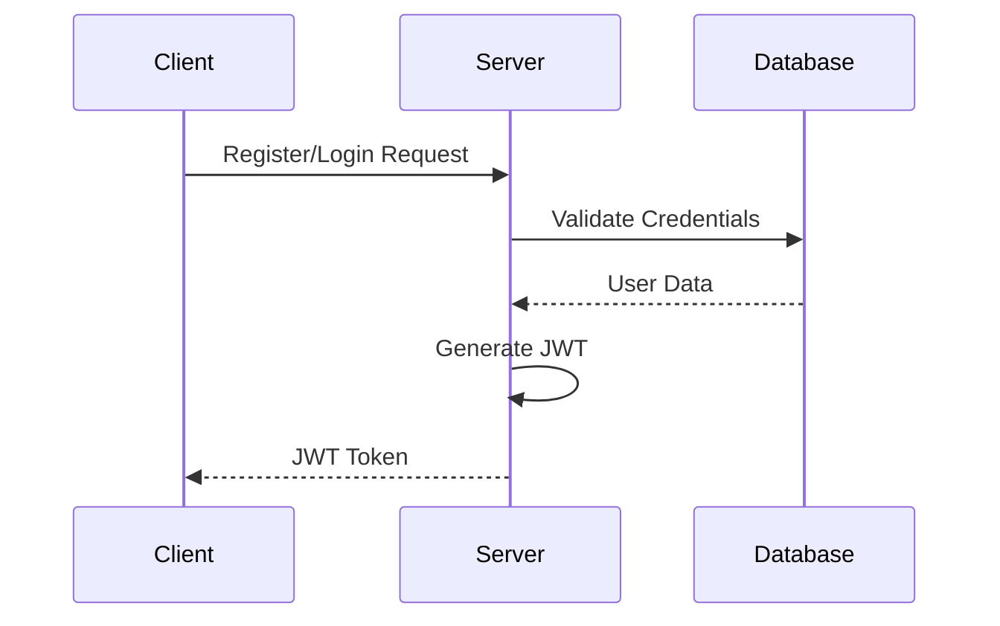
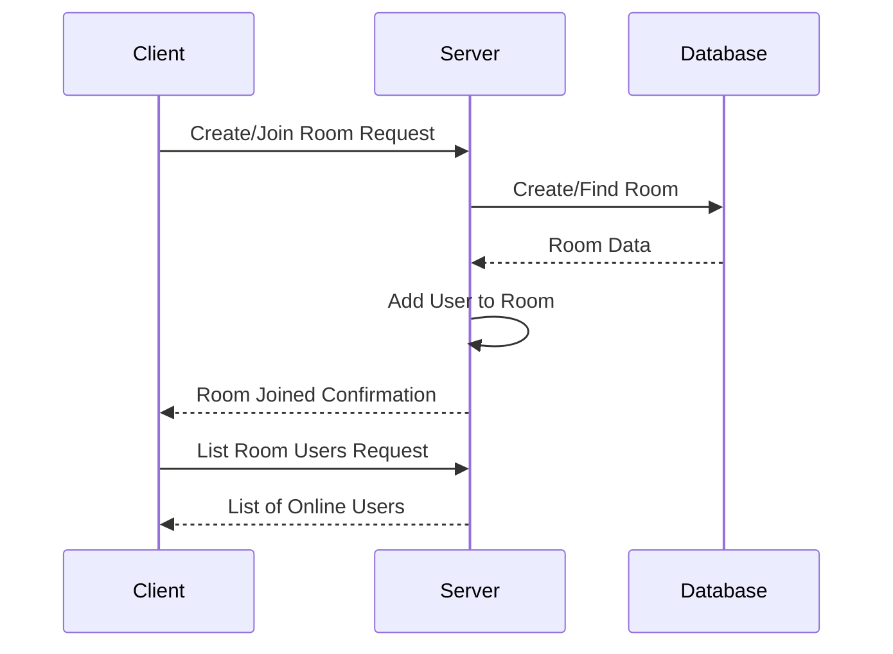
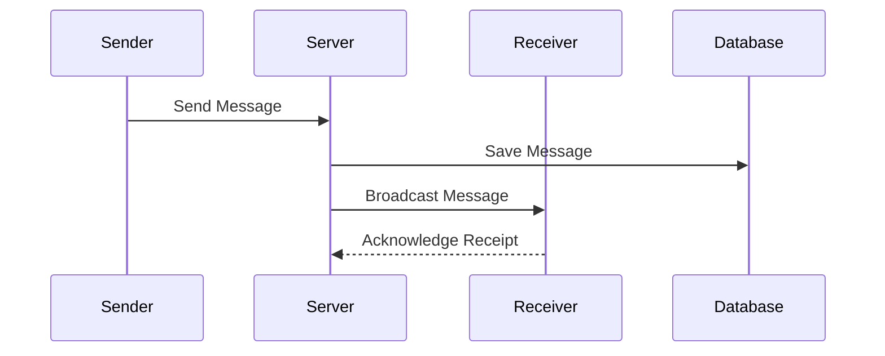
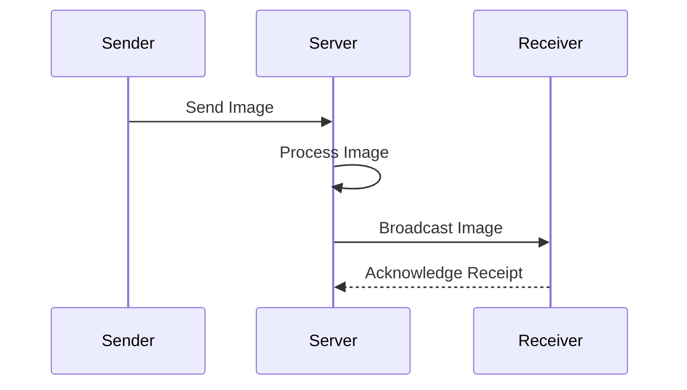
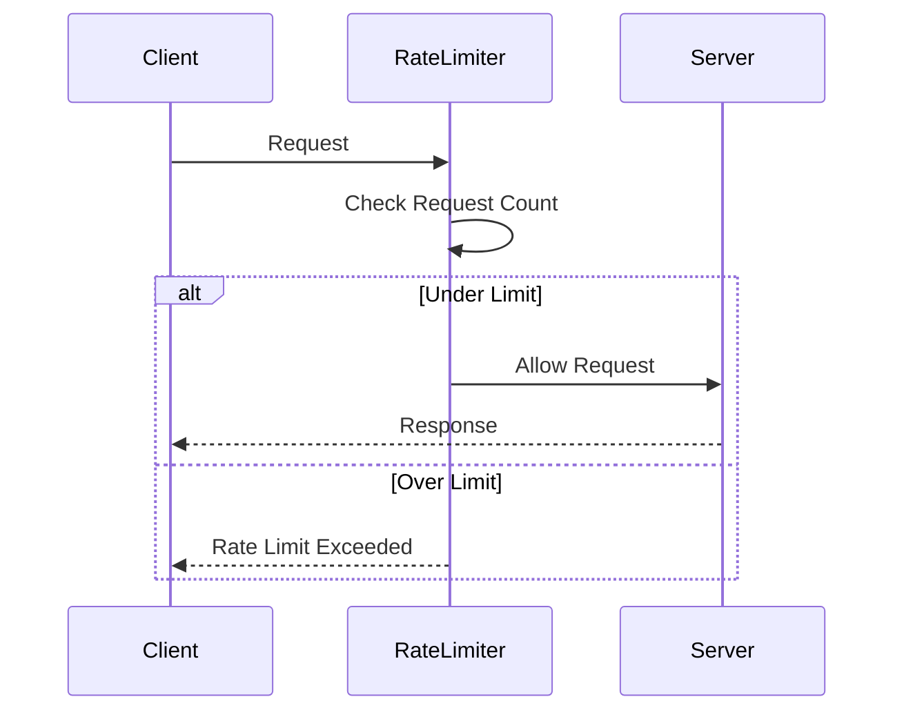

# Node.js Real-Time Chat Application

## Description

This project is a real-time chat application built with Node.js, Express, Socket.io, and MongoDB. It provides a robust platform for users to create chat rooms, join existing rooms, send messages, and share images in real-time. The application implements user authentication, rate limiting, and follows best practices for security and scalability.

## Features

### 1. User Authentication
Users can register and authenticate using JWT (JSON Web Tokens). This ensures secure access to the chat features.

#### Sequence Diagram


### 2. Chat Rooms
Users can create new chat rooms, join existing rooms, and list online users in a room.

#### Sequence Diagram


### 3. Real-Time Messaging
Users can send and receive messages in real-time within chat rooms.

#### Sequence Diagram


### 4. Image Sharing
Users can share images within chat rooms.

#### Sequence Diagram


### 5. Rate Limiting
The application implements rate limiting to prevent abuse and ensure fair usage.

#### Sequence Diagram


## Socket.io Events

The application uses Socket.io for real-time communication. Here's a comprehensive list of events used in the application:

### Server-side Events (Listening)

1. `connection`: Fired when a client connects to the WebSocket server.
   - Authenticates the user using the provided token.
   - Sets up event listeners for the authenticated socket.

2. `disconnect`: Fired when a client disconnects from the WebSocket server.
   - Removes the user from all rooms they were in.
   - Broadcasts user offline status to relevant rooms.

3. `room:create`: Fired when a user wants to create a new chat room.
   - Params: `{ roomName: string }`
   - Creates a new room in the database.
   - Adds the user to the newly created room.

4. `room:join`: Fired when a user wants to join an existing chat room.
   - Params: `{ roomName: string }`
   - Adds the user to the specified room.
   - Broadcasts a user joined message to other room members.

5. `room:list`: Fired when a user requests a list of online users in a chat room.
   - Params: `{ roomName: string }`
   - Returns a list of online users in the specified room.

6. `message:send`: Fired when a user sends a message in a chat room.
   - Params: `{ roomName: string, message: string }`
   - Broadcasts the message to all users in the room.
   - Saves the message to the database.

7. `message:page`: Fired when a user requests a page of messages for a chat room.
   - Params: `{ roomName: string, pageNum: number }`
   - Returns a paginated list of messages for the specified room.

8. `image:send`: Fired when a user sends an image in a chat room.
   - Params: `{ roomName: string, image: binary data }`
   - Processes and saves the image.
   - Broadcasts the image URL to all users in the room.

### Server-side Events (Emitting)

1. `error`: Emitted when an error occurs during WebSocket operations.
   - Data: `{ message: string }`

2. `room:joined`: Emitted when a user successfully joins a room.
   - Data: `{ username: string }`

3. `room:leave`: Emitted when a user leaves a room.
   - Data: `{ username: string }`

4. `message:sent`: Emitted when a new chat message is received.
   - Data: `{ user: string, message: string }`

5. `image:sent`: Emitted when a new image message is received.
   - Data: `{ image: binary data }`

### Client-side Usage

To interact with the WebSocket server, clients should use a Socket.io client library and implement handlers for the above events. Here's a basic example of how to connect and use these events in a client application:

```javascript
import io from 'socket.io-client';

const socket = io('http://localhost:3000', {
  auth: { token: 'your_jwt_token_here' }
});

// Connection event
socket.on('connect', () => {
  console.log('Connected to WebSocket server');
});

// Create a room
socket.emit('room:create', { roomName: 'My New Room' }, (error, response) => {
  if (error) {
    console.error('Error creating room:', error);
  } else {
    console.log('Room created:', response);
  }
});

// Join a room
socket.emit('room:join', { roomName: 'My New Room' }, (error, response) => {
  if (error) {
    console.error('Error joining room:', error);
  } else {
    console.log('Joined room:', response);
  }
});

// Send a message
socket.emit('message:send', { roomName: 'My New Room', message: 'Hello, everyone!' }, (error, response) => {
  if (error) {
    console.error('Error sending message:', error);
  } else {
    console.log('Message sent:', response);
  }
});

// Listen for new messages
socket.on('message:sent', (data) => {
  console.log(`New message from ${data.user}: ${data.message}`);
});

// Handle errors
socket.on('error', (error) => {
  console.error('WebSocket error:', error.message);
});

// Disconnect
socket.on('disconnect', () => {
  console.log('Disconnected from WebSocket server');
});
```

This example demonstrates basic usage of the Socket.io events in a client application. Developers should implement error handling, reconnection logic, and other necessary features for a robust client-side implementation.

## Tech Stack

- Node.js
- Express.js
- Socket.io
- MongoDB with Mongoose
- TypeScript
- JSON Web Tokens (JWT) for authentication
- Joi for data validation
- Docker for containerization
- Bcrypt for password hashing

## Project Architecture and Structure

The project follows a modular architecture, separating concerns into different directories:

- `src/`: Contains the main application code
  - `auth/`: Authentication-related files
  - `messages/`: Message handling logic
  - `rooms/`: Chat room management
  - `users/`: User-related operations
  - `ws/`: WebSocket (Socket.io) handlers
  - `utiles/`: Utility functions and error handling
- `dist/`: Compiled JavaScript files
- `Dockerfile`: Docker configuration for containerization
- `docker-compose.yml`: Docker Compose file for easy deployment
- `tsconfig.json`: TypeScript configuration
- `.env` and `.example.env`: Environment variable management

The application uses a layered architecture:
1. Routes handle incoming HTTP requests
2. Middleware functions process requests (authentication, validation, etc.)
3. Controllers (handlers) contain the business logic
4. Models define data structures and interact with the database

WebSocket communication is handled separately in the `ws/` directory, providing real-time capabilities.

## Getting Started

1. Clone the repository
2. Copy `.example.env` to `.env` and fill in the required environment variables
3. Install dependencies: `yarn install`
4. Start the Docker containers: `docker-compose up`
5. The application will be available at `http://localhost:3000`

For API documentation, refer to the [Postman collection contains](https://www.postman.com/tawapix897/workspace/node-js-test-project/documentation/31138410-3b11ff98-cb43-48d1-829d-c8cec54ebedc).

## Important Notes

- Ensure Docker and docker-compose are installed on your machine
- The application uses rate limiting to prevent abuse
- WebSocket connections require authentication using JWT tokens
- For detailed API information, check the [Postman collection contains](https://www.postman.com/tawapix897/workspace/node-js-test-project/documentation/31138410-3b11ff98-cb43-48d1-829d-c8cec54ebedc).